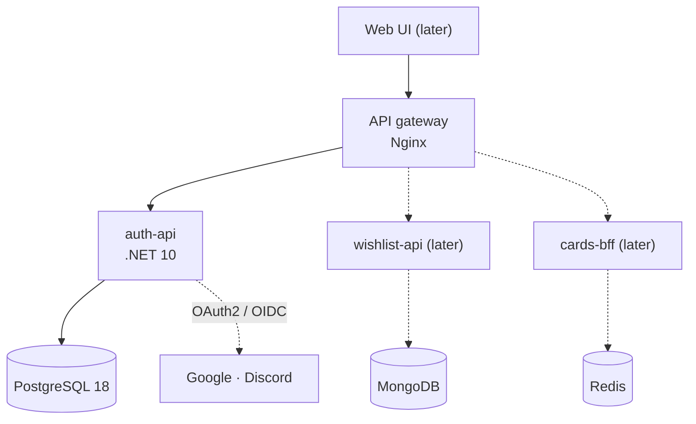

# MyCollection

A platform for trading-card collectors: accounts, wishlists, and card data with aggregated prices. It's built as a microservices monorepo to show modern backend architecture done properly.

> **Status:** architecture and first spec defined; implementation starting. Slice 1 = identity (auth-api) + API gateway.

## Architecture



- **Nx monorepo** (`@nx/dotnet`): one repo, affected-only builds and tests.
- **Hexagonal architecture** in every service (Domain / Application / Infrastructure / Api), enforced by architecture tests.
- **Auth done properly:** RS256 JWTs validated locally via JWKS; rotating refresh tokens with reuse detection in HttpOnly cookies; Google and Discord sign-in with safe account linking.
- **Database per service**, migrations as a separate one-shot step, UUIDv7 ids.
- **Gateway** for routing, CORS, rate limiting and request correlation.
- **Tests:** unit, integration (real Postgres via Testcontainers) and architecture tests; CI on GitHub Actions.

## Tech

.NET 10 · ASP.NET Core Minimal APIs · EF Core 10 · PostgreSQL 18 · Nginx · Docker Compose · Nx 23 · xUnit v3 · Testcontainers · Serilog · OpenAPI + Scalar

## Getting started

Planned (once scaffolded):

```powershell
cp .env.example .env        # fill in OAuth client ids/secrets
docker compose up           # gateway on http://localhost:8080
```

Details: [docs/local-development.md](docs/local-development.md).

## Documentation

Everything is indexed in **[docs/README.md](docs/README.md)**: overview, architecture, services, auth, conventions, testing, local development and a glossary.
