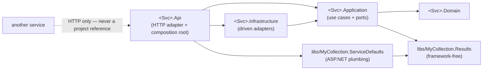
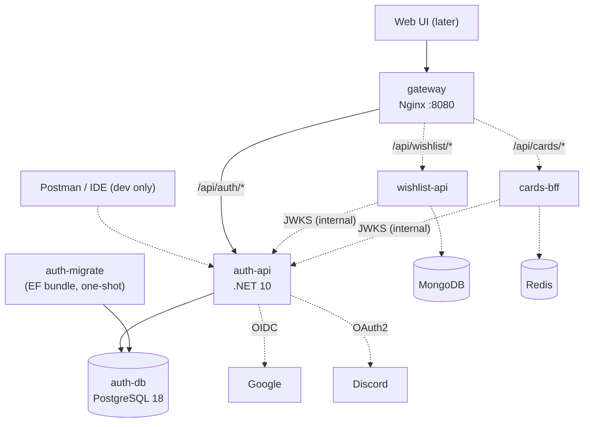
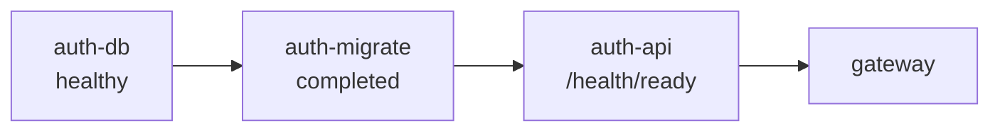
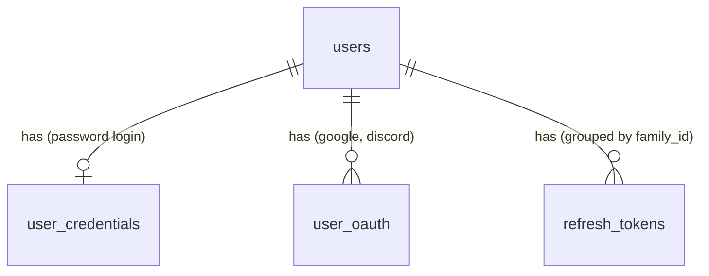

# Architecture Spine — MyCollection platform

## Design Paradigm

**System:** microservices behind a single Nginx gateway. Each service is independently deployable, owns its own database, and talks to other services only over HTTP.

**Inside each service:** hexagonal architecture (ports & adapters), realised as four .NET projects whose references point inward only.

| Layer | Project | Holds | May reference |
|---|---|---|---|
| Domain | `<Svc>.Domain` | Entities, value objects, domain rules | nothing |
| Application | `<Svc>.Application` | Use cases, port interfaces (`I…Repository`, `IUnitOfWork`, `ITokenIssuer`…), service-owned error codes | Domain, `libs/MyCollection.Results` |
| Infrastructure | `<Svc>.Infrastructure` | Driven adapters: EF Core + migrations, crypto, JWT signing, OAuth providers, external HTTP clients | Application, Domain |
| Api | `<Svc>.Api` | Driving adapter (Minimal API endpoints) + composition root (`Program.cs`). The only executable. | all three + `libs/*` |



## Invariants & Rules

### AD-1 — Topology: gateway, database per service, HTTP-only integration [ADOPTED]

- **Binds:** all services, CAP-7
- **Prevents:** services reading each other's tables or sharing a database; clients reaching services by any path other than the gateway outside dev.
- **Rule:** The Nginx gateway is the only public entry point. Every service owns exactly one datastore that no other service reads or writes. Services integrate only through each other's HTTP APIs, calling each other directly on the internal network (not through the gateway) and forwarding the caller's access token. There are no service credentials yet. No project in one service references a project in another service. cards-bff is a data-aggregation BFF, not a token-handling one.

### AD-2 — Hexagonal layering in four projects per service

- **Binds:** all services
- **Prevents:** each service inventing its own structure; EF Core, ASP.NET or HTTP types leaking into business logic.
- **Rule:** Every service is `apps/<svc>/src/{<Svc>.Domain, <Svc>.Application, <Svc>.Infrastructure, <Svc>.Api}`, with references only as in the paradigm table. Application reaches I/O only through port interfaces it declares, and Infrastructure implements them. `<Svc>.Api` is the only deployable. `dotnet publish` of it produces one image and one process.

### AD-3 — Layering is enforced by tests, not only by convention

- **Binds:** all services
- **Prevents:** a direct `PackageReference` (e.g. EF Core in Application) or a `DbContext` in an endpoint silently breaking AD-2.
- **Rule:** Every service has `apps/<svc>/tests/<Svc>.ArchitectureTests` (ArchUnitNET), which asserts at least: Domain depends on no other layer or framework; Application depends only on Domain and `MyCollection.Results`, not on EF Core, ASP.NET Core or Infrastructure; Api does not use `DbContext` or other Infrastructure types except in composition-root registration. The suite also checks each layer's `.csproj` project and package references, and it always runs against a **Debug** build (ArchUnitNET issue #498 drops async dependencies in Release builds). It runs in CI like any test.

### AD-4 — Shared code is plumbing only

- **Binds:** `libs/*`, all services
- **Prevents:** coupling deployables through shared domain assemblies (a Wishlist change forcing an Auth redeploy).
- **Rule:** `libs/` holds exactly two kinds of code. `MyCollection.Results` is framework-free: `Result<T>`, `Error(Code, Kind, Message)` and a fixed `ErrorKind` enum (`Validation`, `Unauthorized`, `Forbidden`, `NotFound`, `Conflict`, `RateLimited`, `Unavailable`). `MyCollection.ServiceDefaults` is ASP.NET plumbing: JWT validation (AD-7), `ErrorKind` → ProblemDetails mapping (AD-13), forwarded headers (AD-15), logging (AD-18), health checks and OpenAPI setup. A domain entity, DTO, use case or service-specific error code is never shared between services.

### AD-5 — One toolchain, one version per package

- **Binds:** all .NET projects
- **Prevents:** services and shared libs drifting onto different SDKs, target frameworks or package versions.
- **Rule:** `global.json` pins the .NET SDK and sets `"test": { "runner": "Microsoft.Testing.Platform" }` (xUnit v3 4.x runs only on MTP v2). `.config/dotnet-tools.json` pins `dotnet-ef`. `Directory.Build.props` sets `net10.0`, nullable enabled and warnings-as-errors for every project. `Directory.Packages.props` (Central Package Management) holds every NuGet version, and no `.csproj` `PackageReference` carries a `Version`.

### AD-6 — auth-api is the sole token issuer; every service validates tokens itself

- **Binds:** auth-api, every protected service, gateway
- **Prevents:** Auth sitting on every request's hot path; services trusting the gateway blindly; secret sprawl (a shared HS256 secret lets any holder mint tokens).
- **Rule:** auth-api signs access tokens with an asymmetric private key (**RS256**) that only auth-api holds. The `kid` header is the key's RFC 7638 thumbprint. auth-api publishes the public keys at `GET /.well-known/jwks.json` and a minimal discovery document (`issuer`, `jwks_uri`) at `GET /.well-known/openid-configuration`. Both are served on the internal network only. Every other service validates tokens locally with the standard JwtBearer handler, configured in ServiceDefaults with `MetadataAddress = Jwt__MetadataUrl` (e.g. `http://auth-api:8080/.well-known/openid-configuration`, or `http://localhost:5001/...` in IDE mode) and `RequireHttpsMetadata = false`, which is allowed because it's the internal network. A service's readiness never depends on auth-api. The gateway performs no token validation.

### AD-7 — One JWT contract; the acting user comes only from `sub`

- **Binds:** auth-api (issuer), all services (validators)
- **Prevents:** services validating different issuers or audiences, or trusting a user id sent in a body, route or query string.
- **Rule:** Access tokens carry `iss=mycollection-auth`, `aud=mycollection`, `sub` (the user id, UUIDv7 as lower-case `Guid.ToString("D")`), `name`, `email`, `iat`, `exp` and `jti`. They carry no roles yet. Validation (issuer and audience as code constants, lifetime, signature, `MapInboundClaims = false` so `sub` keeps its name) is configured once in `libs/MyCollection.ServiceDefaults`. Code reads the acting user only through `ICurrentUser.Id`, which is parsed from `sub`.

### AD-8 — Refresh tokens: opaque, hashed, rotated, family-revoked

- **Binds:** auth-api (CAP-2, CAP-3, CAP-4, CAP-5, CAP-6)
- **Prevents:** long-lived stolen tokens staying usable; logout not actually ending a session; multi-tab refresh races logging users out.
- **Rule:** Access token lifetime is 15 min, and access tokens stay valid until they expire even after logout. A refresh token is an opaque random value (at least 256 bits), stored only as a SHA-256 hash in auth-api's `refresh_tokens` (`id, user_id, family_id, token_hash, replaced_by_id, family_expires_at, expires_at, consumed_at, revoked_at`). Its lifetime is 30 days, sliding on each refresh, capped by the family's **absolute 90-day** limit (`family_expires_at`).
  - **Refresh:** a single conditional `UPDATE … SET consumed_at = now WHERE token_hash = @h AND consumed_at IS NULL AND revoked_at IS NULL AND expires_at > now` consumes the token, in the same transaction as inserting its successor (`replaced_by_id`).
  - **Reuse:** if no row was updated and the token was consumed **≤ 10 s** ago (a multi-tab race), a **new sibling** token is issued in the same family, since raw tokens are never stored and can't be returned. After 10 s, the whole family is revoked and the response is `401 refresh_token_reused`.
  - **Logout** is authenticated by the refresh cookie alone and revokes its family.
  - **Time:** every timestamp comes from the injected `TimeProvider`.

### AD-9 — Token transport: refresh in an HttpOnly cookie, access in the body

- **Binds:** auth-api, gateway CORS, future web UI
- **Prevents:** tokens in URLs or `localStorage`; each login flow (password, Google, Discord) handing tokens to the client differently.
- **Rule:** The refresh token travels only in the cookie `refresh_token` (`HttpOnly; Secure; SameSite=Strict; Path=/api/auth`), never in a body or URL. The access token is returned only in the JSON body, and clients keep it in memory. OAuth completion (AD-22) sets the cookie and `302`s to the frontend, and the client then calls `POST /api/auth/refresh-token` (the same silent refresh used on page load). Every token-issuing endpoint returns the same `TokenResponse { accessToken, expiresAt }`. The web UI must be served from the **same site** as the gateway (same registrable domain; `localhost` in dev), or `SameSite=Strict` blocks the cookie. Dev runs over plain HTTP, which Chromium and Firefox accept for `Secure` cookies on `localhost`; Safari needs HTTPS, which is deferred with TLS.

### AD-10 — Identity and account-linking rules

- **Binds:** auth-api (CAP-1, CAP-2, CAP-5, CAP-6)
- **Prevents:** account takeover through social login; duplicate users per person; storing third-party credentials with no feature behind them.
- **Rule:** Emails are trimmed and lower-cased before they are stored or compared. `users.email` is unique, and `users.email_verified_at` is set only from a provider-asserted verified email. Password sign-ups stay unverified until the email-identity spec lands. Social login with an **unverified** provider email is refused. A social login auto-links by email **only** to a user whose email is verified, i.e. Google ↔ Discord. A verified social login matching an unverified password account is refused (no link, no takeover). Provider access tokens are discarded after login, and `user_oauth` holds only `(id, user_id, provider, provider_user_id, email, linked_at)`. Passwords are bcrypt-hashed in `user_credentials`. *Accepted gap until the email-identity spec: email squatting via password registration.*

### AD-11 — Persistence conventions

- **Binds:** all services with a database
- **Prevents:** incompatible id schemes, time bugs across services, and EF Core leaking out of Infrastructure.
- **Rule:** EF Core (with the Npgsql provider for Postgres) lives only in `<Svc>.Infrastructure`. Entity ids are **UUIDv7**, generated in the application (`Guid.CreateVersion7()`) before insert. Timestamps are UTC: `timestamptz` in Postgres, ISO-8601 with `Z` in JSON. Clients convert to local time. Other services store a user reference as the `sub` string. Application declares `IUnitOfWork`, and **one use case runs as one transaction**. Infrastructure translates unique-constraint violations (Postgres `23505`) into a `Conflict` error, never a 500.

### AD-12 — Migrations run as a separate one-shot step, in every environment

- **Binds:** all services with a relational database, compose
- **Prevents:** replicas racing to migrate; apps needing DDL rights; dev behaving differently from prod.
- **Rule:** Each service's migrations live in its Infrastructure project, with an `IDesignTimeDbContextFactory` that reads only the connection string, so tooling never boots `Program.cs`. They are applied only by an EF Core **migration bundle**, built from the Dockerfile `migrate` target and run as the compose service `<svc>-migrate`. The app depends on it with `condition: service_completed_successfully`. The bundle connects as the database owner; the app connects as `<svc>_app` with DML-only grants. Applications never call `Database.Migrate()`, and `/health/ready` reports unhealthy while migrations are pending.

### AD-13 — Thin Minimal API adapters, `Result<T>`, ProblemDetails

- **Binds:** every `<Svc>.Api`
- **Prevents:** business logic in endpoints; a different error shape per service; exceptions used for control flow.
- **Rule:** Endpoints are Minimal API route groups that only parse → call one use case → map the result. Use cases return `Result<T>` (`libs/MyCollection.Results`) with typed errors for expected failures and throw only for bugs. Every 4xx/5xx body is RFC 9457 ProblemDetails with a stable snake_case `code` (e.g. `invalid_credentials`) and `traceId`. Each service owns its codes; ServiceDefaults owns the single `ErrorKind` → HTTP status mapping. Request-shape validation happens at the edge; business rules live in Application.

### AD-14 — Routing and gateway duties

- **Binds:** gateway, all services, CAP-7
- **Prevents:** paths differing between gateway and direct access; each service reimplementing CORS or rate limiting; internal endpoints leaking publicly.
- **Rule:** Each service serves its full public path, `/api/<area>/…` (auth-api: `/api/auth/…`). The gateway routes by prefix **without rewriting**, and never exposes services' `/health/*` or `/.well-known/*`. `nginx.conf` is rendered from the official image's `templates/` (envsubst). The gateway is the only place for:
  - **CORS:** `GATEWAY_CORS_ORIGINS` is rendered into a `map`. The gateway answers preflight `OPTIONS` itself with `204`, adds CORS headers with `always` (so they're present on 4xx too), and rejects unlisted origins with `403`. Services never register CORS.
  - **Rate limits:** `limit_req_status 429`; global `10r/s burst=20 nodelay` per IP; `POST /api/auth/login` and `/api/auth/register` `5r/m burst=5 nodelay` per IP.
  - **Request ids:** `X-Request-Id` is always generated from `$request_id`, overwriting any client value.
  - **Logging:** the JSON access log.
  - **Errors:** errors the gateway itself produces (404, 429, 502, 503) return static `application/problem+json` bodies.
  - **Upstreams:** resolved at request time (`resolver 127.0.0.11` with variable upstreams), so the gateway survives services being recreated or absent.

### AD-15 — Services trust forwarded headers only from the gateway

- **Binds:** gateway, all services
- **Prevents:** wrong OAuth `redirect_uri` (`http://auth-api:8080/…`), wrong client IPs in logs and limits, and spoofed forwarding headers.
- **Rule:** The gateway overwrites any client-supplied `X-Forwarded-*` headers and sets `X-Forwarded-For` (`$remote_addr`), `X-Forwarded-Proto` (`$scheme`) and `X-Forwarded-Host` (`$http_host`, which keeps the port). Compose puts the gateway and services on a fixed internal subnet. Each service enables ASP.NET Forwarded Headers (in ServiceDefaults) for For, Proto and Host, trusting only `ForwardedHeaders__KnownIPNetworks` (that subnet).

### AD-16 — The OpenAPI document is the committed API contract

- **Binds:** every `<Svc>.Api`, future web UI
- **Prevents:** frontend types hand-copied from C# drifting silently; contract changes going unreviewed.
- **Rule:** The C# request/response records in `<Svc>.Api` are the source of truth. Each build generates `apps/<svc>/openapi/<svc>.json` (`Microsoft.Extensions.ApiDescription.Server`, `--file-name <svc>`), which is **committed**. Startup side effects (key loading, fail-fast validation) are skipped when the entry assembly is the document generator (`GetDocument.Insider`). CI fails if the committed file differs from the generated one. Clients generate their types from it and never hand-write DTO copies. The Scalar UI is served in Development only.

### AD-17 — Configuration and secrets

- **Binds:** all services, compose, tools
- **Prevents:** secrets in git; services booting half-configured.
- **Rule:** Configuration uses .NET options bound from environment variables (`Section__Key`) and is validated at startup (fail fast). Compose reads a gitignored `.env`, and `.env.example` is committed. IDE runs use `appsettings.Development.json` for non-secret localhost defaults and `dotnet user-secrets` for secrets. The JWT private key is a PEM generated by a `tools/` script, mounted into auth-api, and never committed.

### AD-18 — Logging: structured stdout, correlated by request id

- **Binds:** gateway, all services
- **Prevents:** logs that can't be correlated across services; secrets in logs; per-service log destinations.
- **Rule:** Everything logs structured JSON to stdout only (Serilog in services, JSON `log_format` in Nginx). No file sinks. Every service log line carries `service`, `requestId` (from `X-Request-Id`) and `traceId`. Tokens, passwords, secrets and full email addresses are never logged.

### AD-19 — Local environment: one topology, dev differences only in an override

- **Binds:** compose, Dockerfiles, CAP-8
- **Prevents:** dev drifting from the production-shaped topology; ad-hoc ports and startup orders.
- **Rule:** `docker-compose.yml` holds the real topology: gateway, services, `<svc>-migrate`, databases, health checks, a fixed internal subnet, a named volume for Data Protection keys, `ASPNETCORE_ENVIRONMENT=Production`, and only the gateway published, at `8080`. `docker-compose.override.yml` holds only dev differences:
  - `ASPNETCORE_ENVIRONMENT=Development`;
  - the Dockerfile `dev` target: SDK + `dotnet watch` + source mount, with `DOTNET_USE_POLLING_FILE_WATCHER=1` and anonymous volumes for `bin/` and `obj/`;
  - direct service ports (auth-api `5001`, wishlist-api `5002`, cards-bff `5003`) and Postgres `5432`.

  Each service Dockerfile builds with the repo root as context and has `dev`, `migrate` and `final` targets. `final` is based on `aspnet:10.0-alpine`. Each service exposes `/health/live` and `/health/ready` (database plus pending-migrations check) on the internal network. Compose probes them with `wget` and orders startup with `service_healthy`. PostgreSQL 18 data lives in a named volume mounted at `/var/lib/postgresql`.

### AD-20 — Test layers

- **Binds:** all services
- **Prevents:** tests relying on in-memory fakes that behave unlike Postgres; business rules testable only through HTTP.
- **Rule:** Per service: `<Svc>.UnitTests` (Domain and Application, ports faked), `<Svc>.IntegrationTests` (the service in-process via `WebApplicationFactory` plus a real PostgreSQL 18 via Testcontainers, with external OAuth providers faked) and `<Svc>.ArchitectureTests` (AD-3). All use xUnit v3.

### AD-21 — CI runs affected build and test

- **Binds:** repository
- **Prevents:** untested merges.
- **Rule:** A GitHub Actions workflow runs on every push and pull request. It checks out with `fetch-depth: 0`, sets the base and head commits with `nrwl/nx-set-shas`, runs `nx affected -t build test`, fails on OpenAPI drift (`git diff --exit-code -- 'apps/*/openapi'`), and validates the gateway config with `nginx -t`.

### AD-22 — One OAuth sign-in flow for every provider

- **Binds:** auth-api (CAP-5, CAP-6, future providers)
- **Prevents:** Google and Discord built with different mechanisms; callback paths the gateway doesn't route; verified-email checks silently reading a missing claim; open redirects.
- **Rule:**
  - **Handler:** every provider uses the ASP.NET remote authentication handler, with `CallbackPath = /api/auth/<provider>/callback`. It signs into a short-lived external cookie (`ext_auth`, `SameSite=Lax`, `Path=/api/auth`, 5 min).
  - **Completion:** the handler redirects to `/api/auth/<provider>/complete`. That endpoint maps the principal to `ExternalIdentity(provider, providerUserId, email, emailVerified, displayName)`, runs the AD-10 rules, sets the refresh cookie, deletes `ext_auth`, and `302`s to `Frontend__AuthCallbackUrl`, with `?error=<code>` on failure.
  - **Redirect targets** come only from configuration.
  - **Verified email:** each provider maps `emailVerified` explicitly (Google `email_verified`, Discord `verified`); a missing claim means `false`.
  - **Data Protection keys** (which protect the OAuth state) persist to a volume.
  - **Dev redirect URIs:** both the gateway URI (`:8080`) and the direct URI (`:5001`) are registered at each provider.

## Consistency Conventions

| Concern | Convention |
| --- | --- |
| Folders | `apps/<svc>` with the `-api` suffix for .NET HTTP services (`auth-api`, `wishlist-api`); `cards-bff`; `gateway`; `web` (future UI); `libs/MyCollection.<Name>`. |
| .NET projects | PascalCase `<Svc>.<Layer>` (`Auth.Domain`, `Auth.Api`); tests `<Svc>.<Kind>Tests`. |
| Routes | Lowercase kebab-case under `/api/<area>/`. No URL versioning yet. |
| JSON | camelCase properties, enums as strings, dates ISO-8601 UTC with `Z`, ids as UUID strings. |
| Error codes | snake_case, stable once published (`email_already_registered`, `invalid_credentials`, `refresh_token_reused`). |
| Database | snake_case tables and columns, plural table names (`users`, `refresh_tokens`). |
| Env vars | `Section__Key` (`Jwt__SigningKeyPath`, `ConnectionStrings__Postgres`). |
| Commits | Authored as `Marcio <288661246+marciodepaula133@users.noreply.github.com>`. |

## Stack

| Name | Version |
| --- | --- |
| .NET SDK (`global.json`) | 10.0.401 |
| .NET runtime / ASP.NET Core | 10.0.12 (`final` image: `mcr.microsoft.com/dotnet/aspnet:10.0-alpine`) |
| dotnet-ef (local tool) | 10.0.12 |
| Nx | 23.2.1 |
| @nx/dotnet | 23.2.1 |
| Node.js (Nx only) | 24 LTS |
| Nginx image | nginx:1.30-alpine (stable 1.30.5) |
| PostgreSQL image | postgres:18-alpine |
| EF Core / EF Core Design | 10.0.12 |
| Npgsql.EntityFrameworkCore.PostgreSQL | 10.0.3 |
| Microsoft.AspNetCore.Authentication.JwtBearer | 10.0.12 |
| Microsoft.AspNetCore.Authentication.Google | 10.0.12 |
| AspNet.Security.OAuth.Discord | 10.0.0 |
| BCrypt.Net-Next | 4.2.1 |
| Microsoft.AspNetCore.OpenApi / Microsoft.Extensions.ApiDescription.Server | 10.0.12 |
| Scalar.AspNetCore | 2.17.10 |
| Serilog.AspNetCore | 10.0.0 |
| Microsoft.Extensions.Diagnostics.HealthChecks.EntityFrameworkCore | 10.0.12 |
| xunit.v3 | 4.0.1 |
| Microsoft.AspNetCore.Mvc.Testing | 10.0.12 |
| Testcontainers.PostgreSql | 4.15.0 |
| TngTech.ArchUnitNET.xUnitV3 | 0.13.4 |

## Structural Seed

### Containers (dashed = later slices)



### Local startup order (compose)



### auth-api data (names and relationships only)



### Source tree

```text
MyCollection/
  nx.json  package.json  global.json  .config/dotnet-tools.json
  Directory.Build.props  Directory.Packages.props  MyCollection.slnx
  docker-compose.yml  docker-compose.override.yml  .env.example
  apps/
    gateway/            # templates/nginx.conf.template, Dockerfile, project.json
    auth-api/
      src/              # Auth.Domain, Auth.Application, Auth.Infrastructure, Auth.Api
      tests/            # Auth.UnitTests, Auth.IntegrationTests, Auth.ArchitectureTests
      openapi/          # auth-api.json (generated, committed)
      Dockerfile        # targets: dev, migrate, final (context = repo root)
  libs/
    MyCollection.Results/           # Result<T>, Error, ErrorKind (framework-free)
    MyCollection.ServiceDefaults/   # JWT validation, ErrorKind→ProblemDetails, forwarded headers, logging, health, OpenAPI
  tools/                # dev key generation and other scripts
  docs/                 # indexed project docs
  .github/workflows/    # CI
  CLAUDE.md  README.md
```

## Capability → Architecture Map

| Capability / Area | Lives in | Governed by |
| --- | --- | --- |
| CAP-1 Register (email/password) | auth-api `Features/Register` use case; `user_credentials` | AD-2, AD-10, AD-11, AD-13 |
| CAP-2 Password login | auth-api `Login` use case, `ITokenIssuer` | AD-6, AD-7, AD-8, AD-9, AD-10 |
| CAP-3 Refresh | auth-api `RefreshToken` use case; `refresh_tokens` | AD-8, AD-9, AD-11 |
| CAP-4 Logout | auth-api `Logout` use case | AD-8, AD-9 |
| CAP-5 Google sign-in | auth-api OAuth handler (Infrastructure) + `/complete` endpoint | AD-9, AD-10, AD-15, AD-22 |
| CAP-6 Discord sign-in | same, Discord handler | AD-9, AD-10, AD-15, AD-22 |
| CAP-7 Gateway | `apps/gateway` | AD-1, AD-14, AD-15, AD-18, AD-21 |
| CAP-8 One-command local env | compose files, Dockerfiles, `tools/` | AD-12, AD-17, AD-19 |
| Token validation in future services | `libs/MyCollection.ServiceDefaults` | AD-4, AD-6, AD-7 |
| Error handling in every service | `libs/MyCollection.Results` + ServiceDefaults | AD-4, AD-13 |

## Deferred

- **Production deployment and hosting**: target platform, TLS termination at the gateway, secret store for the signing key and OAuth secrets. *Revisit when the first deployment is planned.* AD-12, AD-17 and AD-19 already fix the production-shaped parts.
- **Email identity** (email verification, password reset, SMTP via MailKit, Mailpit in dev): its own spec, `spec-email-identity`. It closes AD-10's accepted squatting gap.
- **Signing-key rotation procedure**: the `kid` and JWKS mechanism exists; a single dev key is enough for now.
- **Observability beyond stdout logs** (central log UI such as Seq or Loki, metrics, tracing): roadmap phase 6.
- **E2E tests** (including a mock OAuth2 server): after the first slice ships.
- **Wishlist and Cards BFF internals** (MongoDB document shape and migrations, Redis cache keys and TTL, resilience library): decided in their own slices, within AD-1 to AD-22. How services call each other is already fixed by AD-1.
- **HTTPS in dev** (so Safari works): with TLS in production.
- **Authorization beyond "authenticated user owns their data"** (roles, admin): no capability needs it yet.
- **API versioning**: until a second client exists.
- **Non-browser clients** (mobile, CLI), which would need body-based refresh: not planned.
- **Web UI stack and TypeScript client generator**: when `apps/web` starts. It must consume AD-16's contract.
- **Nx remote caching (Nx Cloud)**: optional; local cache only for now.

## Open Questions

- **Supported card games:** carried over from the SPEC; doesn't affect this slice.
