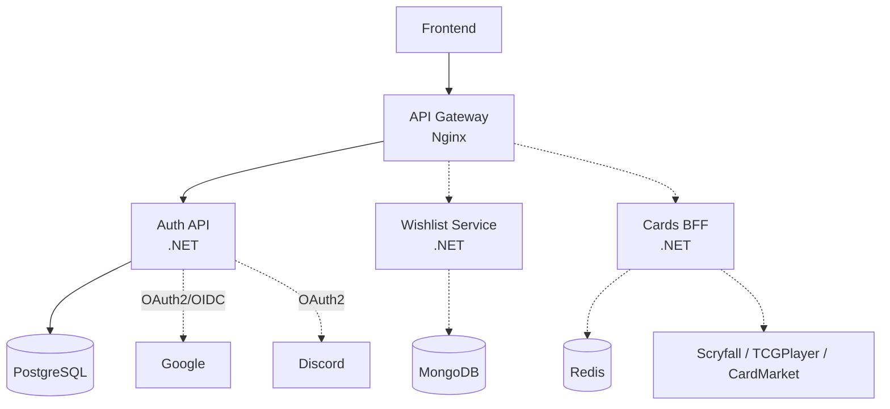
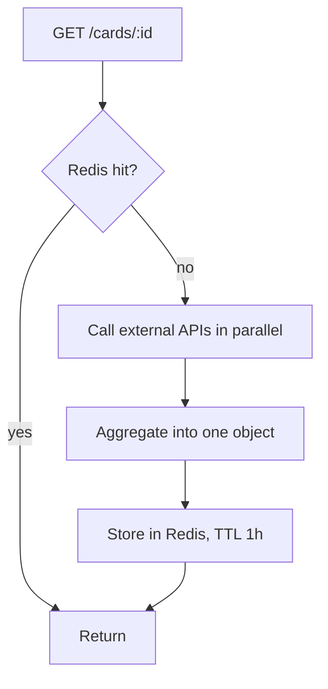

# Architecture diagrams

## Target system (dashed = later slices)

```mermaid
flowchart TD
    FE[Frontend] --> GW[API Gateway<br/>Nginx]
    GW --> AUTH[Auth API<br/>.NET]
    AUTH --> PG[(PostgreSQL)]
    AUTH -. OAuth2/OIDC .-> GOOGLE[Google]
    AUTH -. OAuth2 .-> DISCORD[Discord]
    GW -.-> WL[Wishlist Service<br/>.NET]
    WL -.-> MONGO[(MongoDB)]
    GW -.-> BFF[Cards BFF<br/>.NET]
    BFF -.-> REDIS[(Redis)]
    BFF -.-> EXT[Scryfall / TCGPlayer / CardMarket]
```

## Cards BFF request flow (later slice)

```mermaid
flowchart TD
    R[GET /cards/:id] --> C{Redis hit?}
    C -- yes --> OUT[Return]
    C -- no --> P[Call external APIs in parallel]
    P --> A[Aggregate into one object]
    A --> S[Store in Redis, TTL 1h]
    S --> OUT
```
