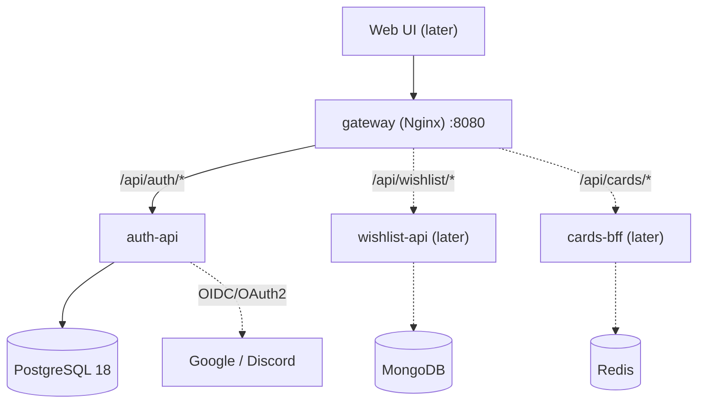
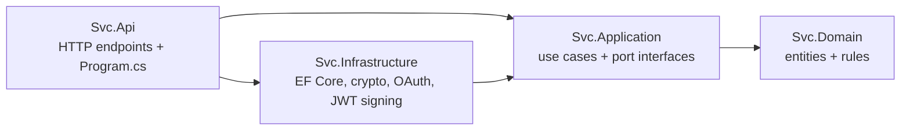

# Architecture

This is a readable summary. The **binding** version, with exact rules, versions and deferred items, is the [architecture spine](../_bmad-output/planning-artifacts/architecture/architecture-MyCollection-API-2026-09-26/ARCHITECTURE-SPINE.md). If the two disagree, the spine wins.

## System

- **One public door:** the gateway handles routing, CORS, rate limits, request ids and access logs. It does **not** check tokens.
- **Each service owns its database.** Nobody else touches it. Services talk only over HTTP.
- **Each service checks JWTs itself**, using auth-api's public key (JWKS). See [auth.md](auth.md).

## Inside a service: hexagonal (ports & adapters)

Four projects per service; references point inward only.

- **Application** says *what it needs* through interfaces (ports), e.g. `IUserRepository`, `IPasswordHasher`. It may also use the shared, framework-free `libs/MyCollection.Results`.
- **Infrastructure** provides the implementations (adapters), e.g. `EfUserRepository`, `BcryptPasswordHasher`.
- **Api** is a thin adapter: parse the request, call one use case, map the `Result` to HTTP.
- Only `Svc.Api` is executable; the four projects publish as **one** container.
- Architecture tests (ArchUnitNET) fail the build if a layer reaches the wrong way.

## Decision index

| AD | In one line |
|---|---|
| AD-1 | Gateway is the only public door; database per service; services integrate only via HTTP. |
| AD-2 | Hexagonal: `Domain ← Application ← Infrastructure ← Api`, four projects per service. |
| AD-3 | Layering enforced by an ArchitectureTests project per service. |
| AD-4 | `libs/` holds only `MyCollection.Results` (framework-free `Result<T>`/`ErrorKind`) and `MyCollection.ServiceDefaults` (ASP.NET plumbing); never domain types, DTOs or service error codes. |
| AD-5 | `global.json`, `Directory.Build.props`, central package versions in `Directory.Packages.props`. |
| AD-6 | auth-api alone signs tokens (RS256) and publishes JWKS + a minimal openid-configuration (internal only); every service validates locally. |
| AD-7 | One JWT claim contract (`iss`, `aud`, `sub`…); the acting user comes only from `sub`. |
| AD-8 | Refresh tokens are opaque, hashed, rotated atomically, family-revoked; the 10 s reuse grace issues a sibling; 15 min / 30 days sliding / 90-day family cap. |
| AD-9 | Refresh token only in an HttpOnly cookie; access token only in the JSON body. |
| AD-10 | Account linking only between verified emails; provider tokens discarded. |
| AD-11 | EF Core only in Infrastructure; UUIDv7 ids; UTC everywhere. |
| AD-12 | Migrations run as a separate one-shot step (`<svc>-migrate`) in every environment. |
| AD-13 | Thin Minimal API endpoints; `Result<T>`; ProblemDetails with a stable `code`. |
| AD-14 | Services own the full `/api/<area>` path; the gateway routes by prefix and alone owns CORS (incl. preflight), rate limits (429), request ids and problem+json gateway errors. |
| AD-15 | Forwarded headers are trusted only from the gateway. |
| AD-16 | OpenAPI generated at build and committed; clients generate types from it. |
| AD-17 | Config from env vars, validated at startup; secrets never in git. |
| AD-18 | Structured JSON logs to stdout, correlated by `requestId`; never log secrets. |
| AD-19 | `docker-compose.yml` = real topology; `docker-compose.override.yml` = dev-only differences. |
| AD-20 | Unit + integration (Testcontainers Postgres) + architecture tests, xUnit v3. |
| AD-21 | CI runs `nx affected -t build test`, an OpenAPI drift check and `nginx -t`. |
| AD-22 | One OAuth flow for every provider: ASP.NET handler → `/api/auth/<provider>/callback` → `/complete` → refresh cookie → redirect to the frontend. |

Rationale for each decision: see the decision log (`.memlog.md`) next to the spine.
